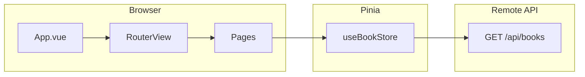

# vue-courses — Project documentation

This document describes what **vue-courses** is, how the pieces fit together, and the practical **ins and outs** of the current implementation. It is meant to complement the default `README.md` with a clear mental model for reading and extending the code.

---

## What this project is

**vue-courses** is a small **Vue 3** single-page app that simulates a simple **course marketplace**: you browse items from a remote API, add them to a **cart**, **confirm** to “own” them in **My Courses**, and open a **per-course details** screen from the URL. The backend API names the resources **books**; the UI treats them as **courses**—same data, different vocabulary.

The app is scoped as a **learning project**: it demonstrates **Vue Router**, **Pinia**, **axios**, **Composition API** with `<script setup>`, **Tailwind CSS**, and **client-side persistence** for cart and purchases—without real payments or authentication.

---

## Main ideas (the “keys”)

| Topic | Role in this project |
|--------|----------------------|
| **Vue 3 + Vite** | Fast dev server, SFCs (`.vue`), production build. |
| **Vue Router** | Maps URLs to page components; dynamic segment for course id. |
| **Pinia** | One store (`book`) holds catalog, cart, owned courses, loading. |
| **pinia-plugin-persistedstate** | Persists `cart` and `myCourses` in the browser across refresh. |
| **axios** | `GET` catalog from a hosted REST API. |
| **Tailwind v4** | Utility-first styling; Comfortaa font via `main.css` `@theme`. |

---

## Architecture at a glance

- **`App.vue`** wraps every screen with **header**, **main** (scrollable content + `RouterView`), and **footer**, and currently triggers an initial **`fetchCourses()`** on mount so the catalog tends to be loaded early.
- **Pages** under `src/pages/` are mostly thin: they read the store and render **cards** or **lists**.
- **Presentational components** (`BookCard`, `CartItem`, …) avoid business rules where possible; **cart logic stays in the store**.

---

## User-visible behavior

1. **Home** — Intro, two grids of courses (see *Honest labels* below), static review quotes.
2. **Courses** — Full catalog grid; cart count in the header area.
3. **Course details** — URL `/courses/:courseId`; shows title, category, author, and a **dummy description** attached when the catalog is fetched.
4. **My Cart** — Confirm (move to owned) or Delete (remove from cart).
5. **My Courses** — Un-enrol removes an owned entry.
6. **404** — Unknown paths show a simple not-found message with a link home.

**Buy Now** is disabled (gray) when the course is **already in cart** or **already owned**. **Course details** is a secondary control next to Buy Now.

---

## Routes

| Path | Name | Page |
|------|------|------|
| `/` | `home` | `HomePage.vue` |
| `/courses` | `courses` | `CoursesPage.vue` |
| `/courses/:courseId` | `courseDetails` | `CourseDetailsPage.vue` |
| `/cart` | `cart` | `CartPage.vue` |
| `/my-courses` | `myCourses` | `MyCoursesPage.vue` |
| `*` (catch-all) | `notFound` | `NotFoundPage.vue` |

Order matters: the static `/courses` route must be registered **before** `/courses/:courseId` so the list view is not swallowed by the dynamic route.

---

## Data shapes

### API → catalog (`bookStore.courses`)

Each item is whatever the API returns (typically `_id`, `title`, `author`, `category`, …) **plus** a client-only field:

- **`description`** — Picked from a fixed **`COURSE_DESCRIPTIONS`** array in `store.js` using `index % length` when `fetchCourses` maps the response. Used on the details page, not from the server.

### Cart entry (`normalizeCourse`)

Stored in `bookStore.cart`:

- **`cartItemId`** — Unique per row (`crypto.randomUUID()`), so the same catalog course could theoretically appear twice if you changed rules later.
- **`id`** — Same as API **`_id`** (used for duplicate / purchased checks).
- **`title`**, **`author`**, **`category`**.

### Owned entry (`myCourses`)

Spread of the cart item **plus**:

- **`purchasedId`** — Unique id for un-enrol and list keys.

---

## Pinia store (`src/stores/store.js`)

**State:** `courses`, `loading`, `cart`, `myCourses`.

**Persistence:** `persist: { pick: ["cart", "myCourses"] }` — catalog is **not** persisted; it is refetched when `fetchCourses` runs.

**Getters:**

- **`isInCart(courseId)`** / **`isPurchased(courseId)`** — Compare against cart / owned **`id`** (API id).
- **`latestCourses`** — `courses.slice(0, 3)`.
- **`highestRatedCourses`** — `courses.slice(3, 6)`.

**Actions (high level):**

- **`fetchCourses`** — Sets `loading`, GET books, maps in `description`, assigns `courses`.
- **`addToCart`** — Skips if missing id, already purchased, or already in cart; **`push`**es normalized item.
- **`removeFromCart(cartItemId)`** — Filter by line id.
- **`confirmPurchase(cartItemId)`** — If not already owned, push to `myCourses` with `purchasedId`; then remove from cart.
- **`unenrollCourse(purchasedId)`** — Remove from `myCourses`.

> **Note:** An **`ensureCoursesLoaded`** helper exists in comments in some revisions; if you rely on it, uncomment and call it from pages instead of duplicating `fetchCourses` everywhere. The **ins & outs** section below discusses fetch strategy.

---

## Important flows

### Browse and add to cart

1. Catalog is loaded via **`fetchCourses`** (e.g. from `App.vue` on mount).
2. **`BookCard`** emits **`click`** on Buy Now; parent calls **`addToCart(course)`**.
3. Store checks purchase / cart state; cart updates and **persists**.

### Purchase (confirm)

1. **`CartPage`** passes **`cartItemId`** into **`confirmPurchase`**.
2. Item moves to **`myCourses`** and leaves **`cart`**; both persisted.

### Course details (deep link)

1. User clicks **Course details** → `RouterLink` with **`name: 'courseDetails'`** and **`params: { courseId: course._id }`**.
2. URL becomes **`/courses/<thatId>`**.
3. **`CourseDetailsPage`** reads **`route.params.courseId`** and **`find`s** the matching course in **`bookStore.courses`**.
4. There is **no second API call** for one course; the row must already exist in memory. If the user opens a details URL **before** the catalog has loaded, they may briefly see loading or **not found** until **`fetchCourses`** completes.

---

## Components (where logic lives)

| Area | Files |
|------|--------|
| Layout | `App.vue`, `shared/AppHeader.vue`, `shared/AppFooter.vue` |
| Catalog card | `components/BookCard.vue` (Buy Now + Course details), `components/CardSections.vue`, `components/RoundedButton.vue` |
| Cart / owned | `shared/CartItem.vue`, `shared/MyCourseCard.vue` |
| Misc UI | `shared/LoadingSpinner.vue`, `shared/ReviewCard.vue` |

**`BookCard`** props include **`description`** (in practice fed **`category`** from parents) and **`courseId`** for the details link—naming reflects history; the footer line is “category as subtitle,” not the long **`description`** field used on the details page.

---

## Styling

- **`src/assets/main.css`** — Imports Tailwind and sets **`@theme`** font; **`.app-main`** adds top/bottom padding so content clears the **fixed** header and footer.
- **`index.html`** — Page background gradient on `<body>`.

---

## Tooling (short)

- **`npm run dev`** — Vite dev server.
- **`npm run build`** / **`npm run preview`** — Production build and local preview.
- **`npm run lint`** — oxlint + ESLint.
- **`npm run format`** — Prettier on `src/`.
- **`npm run server`** — Optional **json-server** for a local mock API; the app **defaults** to the hosted URL in `store.js`, so this script is optional for local experiments.

**`@` alias** — Resolves to `src/` (`vite.config.js`, `jsconfig.json`).

---

## Ins and outs

### Strengths

- **Clear separation**: routing in one place, shared state in Pinia, pages mostly declarative.
- **Realistic enough UX**: cart + persistence + disabled states for duplicate adds.
- **Sharable URLs** for course details (`/courses/:courseId`).
- **Small surface area** — easy to read for coursework or interviews.

### Tradeoffs and limitations

- **No auth, no server-side cart** — Everything is local to the browser; clearing site data loses “purchases” unless you rely on persistence storage.
- **Catalog vs. labels** — “Latest” / “Highest rated” are **positional slices** of the API list, not real timestamps or ratings. Renaming sections to “Featured” / “More courses” would match behavior better.
- **Single fetch, client-side join** — Details view does not call `GET /books/:id`; it only **finds** in `courses`. Simple, but wrong if you ever need pagination or huge catalogs.
- **Error handling** — Failed `fetchCourses` is logged; the UI may show an empty grid or spinner without a dedicated error message unless you add one.
- **Possible duplicate fetches** — If both **`App.vue`** and individual pages call **`fetchCourses`** on mount, you can hit the API more than once; centralizing on **`ensureCoursesLoaded`** (or a single caller) avoids that.

### Sensible next enhancements (optional)

- One **guard** for loading catalog (`ensureCoursesLoaded`) and **error / retry UI**.
- **Lazy-loaded routes** for smaller initial bundle.
- **`lang` attribute** on `<html>` and clearer **focus** styles for accessibility.

---

## Quick file map

| Concern | Path |
|---------|------|
| Bootstrap | `src/main.js` |
| Shell layout | `src/App.vue` |
| Routes | `src/router/index.js` |
| State + API | `src/stores/store.js` |
| Pages | `src/pages/*.vue` |
| Shared widgets | `src/shared/*.vue` |
| Reusable course UI | `src/components/*.vue` |
| Global styles | `src/assets/main.css` |

---

## Summary

**vue-courses** is a compact Vue 3 app that wires **routing**, **global state**, and a **REST catalog** into a coherent **browse → cart → own** flow, with **persisted** cart/owned data and a **parameterized** course details screen. Understanding the **store** and the **route param → `find` in `courses`** pattern explains most of the runtime behavior; the rest is layout and presentation.
